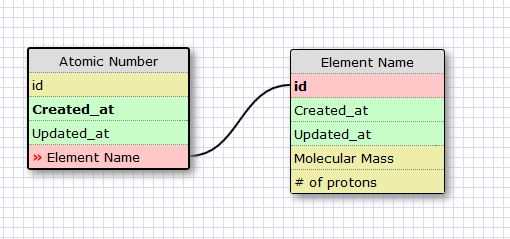
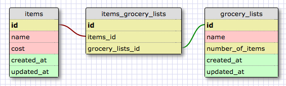

RELEASE 2

This relationship is one to one because each element only has one atomic number, and each atomic number only has one element name.

RELEASE 4

Reflection

    What is a one-to-one database?
        A one-to-one database is a database that has a two tables that form a one-to-one relationship between fields. An example would be a car and a manufacturer. Each car only has one manufacturer but when loading information on a car the manufacturer may be optional.
    When would you use a one-to-one database? (Think generally, not in terms of the example you created).
        You would use a one-to-one database when there is a corresponding one-to-one situation in real-life except that the information may be optional to one table.
    What is a many-to-many database?
        A many-to-many database is a database that contains a many-to-many relationship between tables. That is that the field of one table can link to many fields of another table and vice versa.
    When would you use a many-to-many database? (Think generally, not in terms of the example you created).
        You would use a many-to-many database to model a situation in real-life where one entity can link to many other entities and vice versa.
    What is confusing about database schemas? What makes sense?
        Right now it is not intuitive for me to go from real-life examples to a database structure that would model the situation effectively.
